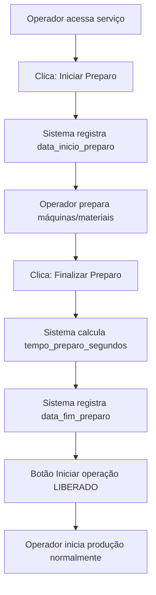

# 🔧 Controle de Tempo de Preparo do Serviço

## ✅ Nova Funcionalidade Implementada

Sistema agora permite registrar o **tempo de preparo das máquinas e materiais** antes de iniciar a produção das peças.

---

## 🎯 Como Funciona

### 1. Fluxo do Operador

**ANTES DE PRODUZIR**, o operador deve:

1. **Iniciar Preparo** 🔧
   - Clica no botão "▶️ Iniciar Preparo"
   - Sistema registra data/hora de início
   - Operador prepara máquinas, materiais, moldes, etc.

2. **Finalizar Preparo** ✅
   - Após tudo pronto, clica "✅ Finalizar Preparo"
   - Sistema calcula e salva o tempo de preparo
   - Libera botão "Iniciar operação"

3. **Produzir Peças** 📦
   - Agora pode iniciar a produção normalmente
   - Registra peças produzidas

### 2. Bloqueio de Segurança

🔒 **Importante:** Não é possível iniciar a produção sem finalizar o preparo!

O botão "Iniciar operação" fica **desabilitado** até que o preparo seja concluído.

### 3. Rastreamento Completo

O sistema registra:
- ⏱️ **Data/hora início do preparo**
- ⏱️ **Data/hora fim do preparo**
- 📊 **Tempo total de preparo** (em segundos)

---

## 📂 Arquivos Modificados

### 1. Schema do Banco de Dados
**Arquivo:** `prisma/schema.prisma`
```prisma
model Service {
  // ... campos existentes
  data_inicio_preparo           DateTime?
  data_fim_preparo              DateTime?
  tempo_preparo_segundos        Int?
}
```

### 2. Migration
**Arquivo:** `prisma/migrations/20251216000001_add_service_preparation_time/migration.sql`
- SQL para adicionar campos de preparo

### 3. API de Preparo (NOVA)
**Arquivo:** `app/api/production/preparation/route.ts`

**Endpoints:**
- `POST /api/production/preparation`
  - Body: `{ serviceId: string, action: 'start' | 'finish' }`
  - Inicia ou finaliza o preparo
  
- `GET /api/production/preparation?serviceId=xxx`
  - Retorna status do preparo

### 4. Interface do Operador
**Arquivo:** `app/operador/[operatorId]/[serviceId]/page.tsx`

**Alterações:**
- ➕ Seção "🔧 Preparo do Serviço" (card amarelo/âmbar)
- ➕ Botões "Iniciar Preparo" e "Finalizar Preparo"
- ➕ Display de tempo de preparo após conclusão
- 🔒 Botão "Iniciar operação" desabilitado até preparo finalizar

### 5. Funções Helper
**Arquivo:** `lib/time-calculations.ts`

Nova função:
```typescript
calculateCompleteServiceTime(sessions, tempoPreparoSegundos)
// Retorna: { tempoPreparo, tempoProducao, tempoTotal }
```

### 6. Dashboard de Métricas
**Arquivo:** `app/dashboard/metrics/page.tsx`

Serviços concluídos agora mostram:
- 🔧 **Tempo Preparo** (separado, em âmbar)
- ⏱️ **Tempo Produção** (azul)
- 📊 **Tempo Total** (verde, em destaque)

### 7. Página de Serviços
**Arquivo:** `app/dashboard/services/page.tsx`

Lista de serviços mostra:
- 🔧 Preparo: Xh Ymin
- ⏱️ Produção: Xh Ymin
- 📊 Total: Xh Ymin (em negrito verde)

---

## 🎨 Interface Visual

### Operador - Antes de Iniciar Produção

```
┌───────────────────────────────────────────────────────┐
│ 🔧 Preparo do Serviço                                 │
├───────────────────────────────────────────────────────┤
│ Antes de iniciar a produção, registre o tempo de     │
│ preparo das máquinas e materiais.                     │
│                                                       │
│  [▶️ Iniciar Preparo]                                 │
└───────────────────────────────────────────────────────┘
```

### Durante o Preparo

```
┌───────────────────────────────────────────────────────┐
│ 🔧 Preparo do Serviço                                 │
├───────────────────────────────────────────────────────┤
│ ⏱️ Preparo iniciado em: 16/12/2025 08:00:00          │
│                                                       │
│  [✅ Finalizar Preparo]                               │
└───────────────────────────────────────────────────────┘
```

### Após Finalizar Preparo

```
┌───────────────────────────────────────────────────────┐
│ ✅ Preparo Concluído                                  │
│ Tempo de preparo: 0h 25min                            │
└───────────────────────────────────────────────────────┘

 [Iniciar operação]  ← AGORA HABILITADO
```

### Dashboard - Serviço Concluído

```
┌────────────────────────────────────────┐
│ ✅  Fundição XYZ                       │
│     Peças em alumínio                  │
│                                        │
│  🔧 Tempo Preparo:     25min          │
│  ⏱️ Tempo Produção:    2h 20min       │
│  ────────────────────────────────     │
│  📊 Tempo Total:       2h 45min       │
│  📅 Concluído em:      16/12/2025     │
│  📦 Peças:             3 tipos         │
└────────────────────────────────────────┘
```

---

## 🔄 Fluxo Completo



---

## 📊 Exemplo Prático

### Cenário Real:
**Serviço:** Fundição de peças em alumínio

**Fase 1: Preparo**
- 08:00 - Operador clica "Iniciar Preparo"
- 08:00-08:25 - Prepara moldes, ajusta máquinas, organiza materiais
- 08:25 - Clica "Finalizar Preparo"
- **Tempo de Preparo: 25 minutos**

**Fase 2: Produção**
- 08:25 - Clica "Iniciar operação"
- 08:25-12:00 - Produz peças (sessão 1)
- 12:00-13:00 - Pausa almoço
- 13:00-17:00 - Produz peças (sessão 2)
- 17:00 - Finaliza operação
- **Tempo de Produção: 7 horas 35 minutos**

**Resultado Final:**
```
🔧 Tempo Preparo:   25min
⏱️ Tempo Produção:  7h 35min
📊 Tempo Total:     8h 0min
```

---

## 🧪 Como Testar

### Teste 1: Fluxo Completo de Preparo

1. **Login como operador**
   ```
   Email: operador1@example.com
   Senha: op123
   ```

2. **Selecionar serviço**
   - Clica em um card de serviço

3. **Iniciar Preparo**
   - Clica "▶️ Iniciar Preparo"
   - ✅ Verifica que botão mudou para "Finalizar Preparo"
   - ✅ Verifica que mostra horário de início

4. **Tentar iniciar produção (deve falhar)**
   - Botão "Iniciar operação" está desabilitado
   - Mostra texto "🔒 Finalize o preparo primeiro"

5. **Finalizar Preparo**
   - Clica "✅ Finalizar Preparo"
   - ✅ Verifica card verde "Preparo Concluído"
   - ✅ Verifica tempo calculado

6. **Iniciar Produção**
   - Botão "Iniciar operação" agora está habilitado
   - Clica e produz normalmente

### Teste 2: Verificar nos Relatórios

1. **Como Admin**
   - Dashboard → Acompanhamento
   - Produzir todas as peças do serviço
   - Finalizar operação

2. **Verificar Serviços Concluídos**
   - Card mostra tempo de preparo separado
   - Card mostra tempo de produção
   - Card mostra tempo total (soma)

3. **Verificar Página de Serviços**
   - Dashboard → Serviços
   - Serviço concluído tem badge ✅
   - Mostra breakdown: Preparo + Produção = Total

---

## 🚀 Benefícios

✅ **Rastreamento Completo** - Sabe quanto tempo levou o preparo
✅ **Segurança** - Garante que preparo foi feito antes
✅ **Relatórios Precisos** - Tempo total inclui preparo + produção
✅ **Análise Separada** - Pode otimizar preparo vs produção
✅ **Histórico** - Tudo registrado no banco de dados

---

## 📝 Observações Técnicas

### Validações
- ✅ Não pode iniciar preparo duas vezes
- ✅ Não pode finalizar preparo sem ter iniciado
- ✅ Não pode iniciar produção sem finalizar preparo
- ✅ Tempo calculado automaticamente

### Compatibilidade
- Serviços antigos (sem preparo) continuam funcionando
- Campos são nullable no banco
- Interface se adapta (não mostra se não tem)

### Performance
- Consulta leve (apenas campos do Service)
- Sem impacto na produção em andamento
- Cálculo simples (diferença de timestamps)

---

**Implementado em:** 16/12/2025  
**Versão:** 1.2
