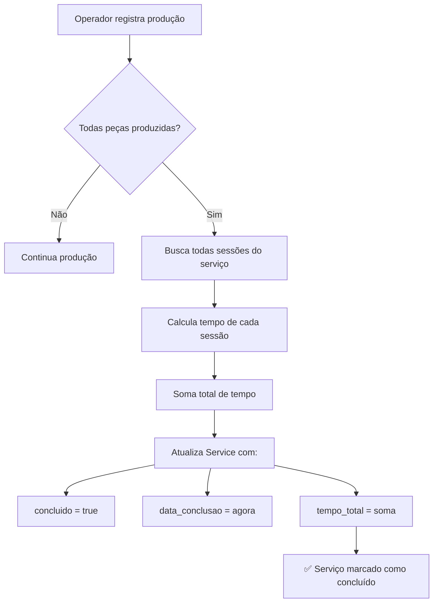

# 📊 Controle de Tempo Total de Produção

## ✅ Nova Funcionalidade Implementada

Sistema agora calcula e exibe o **tempo total gasto para produzir um serviço completo** quando todas as peças forem concluídas.

---

## 🎯 Como Funciona

### 1. Detecção Automática de Conclusão
Quando um operador registra a produção de uma peça, o sistema:
- ✅ Verifica se todas as peças do serviço foram produzidas
- ✅ Compara total produzido vs total previsto
- ✅ Se 100% concluído → marca serviço como concluído

### 2. Cálculo do Tempo Total
O sistema soma automaticamente:
- ⏱️ Tempo de todas as sessões de trabalho
- ⏱️ De todos os operadores que trabalharam no serviço
- ⏱️ Desconta pausas de almoço
- ⏱️ Calcula desde o início até a finalização

### 3. Armazenamento
Os seguintes campos foram adicionados ao serviço:
```typescript
{
  concluido: boolean                      // true quando 100% produzido
  data_conclusao: DateTime                // data/hora da conclusão
  tempo_total_producao_segundos: number   // tempo total em segundos
}
```

---

## 📂 Arquivos Modificados

### 1. Schema do Banco de Dados
**Arquivo:** `prisma/schema.prisma`
- ➕ Campo `concluido` (boolean)
- ➕ Campo `data_conclusao` (DateTime)
- ➕ Campo `tempo_total_producao_segundos` (Int)

### 2. Migration
**Arquivo:** `prisma/migrations/20251216000000_add_service_completion_fields/migration.sql`
- SQL para adicionar os novos campos

### 3. Funções Helper
**Arquivo:** `lib/time-calculations.ts` (NOVO)
- `calculateSessionDuration()` - Calcula tempo de uma sessão
- `calculateTotalServiceTime()` - Soma todas as sessões
- `formatDuration()` - Formata para HH:MM:SS
- `formatDurationShort()` - Formata para "2h 30min"

### 4. API de Produção
**Arquivo:** `app/api/production/counts/route.ts`
- ➕ Função `checkAndCompleteService()` que:
  - Busca todas as peças do serviço
  - Calcula totais previsto vs produzido
  - Se 100% → calcula tempo e marca como concluído
- ✅ Integrada nos endpoints POST (registro de produção)

### 5. Dashboard de Métricas
**Arquivo:** `app/dashboard/metrics/page.tsx`
- ➕ Card KPI "Serviços Concluídos"
- ➕ Seção "✅ Serviços Concluídos" mostrando:
  - Nome do cliente
  - Descrição do serviço
  - ⏱️ Tempo total de produção
  - 📅 Data de conclusão
  - 📦 Número de tipos de peças

### 6. Página de Serviços
**Arquivo:** `app/dashboard/services/page.tsx`
- ✅ Badge verde para serviços concluídos
- ⏱️ Exibição do tempo total na listagem
- 📅 Data de conclusão

---

## 🎨 Interface Visual

### Dashboard de Acompanhamento
```
┌─────────────────────────────────────────────────────┐
│ ✅ Serviços Concluídos                              │
├─────────────────────────────────────────────────────┤
│  ┌───────────────────────────────┐                  │
│  │ ✅  Fundição XYZ              │                  │
│  │     Peças em alumínio         │                  │
│  │                               │                  │
│  │  ⏱️ Tempo Total:    2h 45min  │                  │
│  │  📅 Concluído em:  16/12/2025 │                  │
│  │  📦 Peças:         3 tipos    │                  │
│  └───────────────────────────────┘                  │
└─────────────────────────────────────────────────────┘
```

### Página de Serviços
```
┌──────────────────────────────────────────────────────────┐
│ Cliente          │ Descrição    │ Previsão  │ Peças     │
├──────────────────────────────────────────────────────────┤
│ ✅ Fundição XYZ  │ Alumínio     │ 15/12/25  │ 3 peças   │
│                  │              │ Concluído │ ⏱️ 2h 45m │
│                  │              │ 16/12/25  │           │
└──────────────────────────────────────────────────────────┘
```

---

## 🔄 Fluxo de Funcionamento



---

## 📊 Exemplo de Cálculo

### Cenário:
**Serviço:** Fundição de Peças em Alumínio
**Peças:**
- Corpo da bomba: 100 unidades
- Rotor: 50 unidades

### Sessões de Trabalho:
1. **Operador 1 - Sessão 1:**
   - Início: 08:00
   - Pausa almoço: 12:00 - 13:00
   - Fim: 17:00
   - Tempo trabalhado: 8h (descontando 1h de almoço)

2. **Operador 2 - Sessão 1:**
   - Início: 08:30
   - Pausa almoço: 12:30 - 13:30
   - Fim: 16:30
   - Tempo trabalhado: 7h (descontando 1h de almoço)

3. **Operador 1 - Sessão 2:**
   - Início: 08:00
   - Fim: 10:30
   - Tempo trabalhado: 2h 30min

### Resultado:
**Tempo Total:** 8h + 7h + 2h 30min = **17h 30min**

Quando a peça 150 (última) for registrada:
```
✅ Serviço Fundição de Peças em Alumínio concluído!
⏱️ Tempo total: 17h 30min (63000 segundos)
📅 Data: 16/12/2025
```

---

## 🧪 Como Testar

### Passo 1: Criar um serviço pequeno
```
Cliente: Teste Tempo
Peça 1: Corpo (qty: 5)
```

### Passo 2: Operador inicia produção
```
→ Inicia sessão
→ Adiciona 5 peças (+ 1, + 1, + 1, + 1, + 1)
```

### Passo 3: Verificar conclusão
```
✅ Serviço automaticamente marcado como concluído
⏱️ Tempo calculado e salvo
```

### Passo 4: Ver no dashboard
```
→ Vai para Dashboard → Acompanhamento
→ Vê card "Serviços Concluídos" = 1
→ Vê detalhes do serviço com tempo total
```

---

## 🚀 Benefícios

✅ **Automático** - Não precisa marcar manualmente
✅ **Preciso** - Soma todas as sessões de todos operadores
✅ **Considera pausas** - Desconta tempo de almoço
✅ **Visual** - Cards e badges para fácil identificação
✅ **Relatórios** - Histórico completo de tempo por serviço

---

## 📝 Observações Técnicas

### Performance
- Cálculo executa apenas quando uma peça é registrada
- Verificação otimizada com aggregates do Prisma
- Não impacta produção em andamento

### Integridade
- Migration automática adiciona campos
- Valores nullable para serviços antigos
- Backward compatible

### Consistência
- Tempo calculado no momento da conclusão
- Não recalcula após marcado como concluído
- Timestamp da conclusão registrado

---

**Implementado em:** 16/12/2025
**Versão:** 1.1
